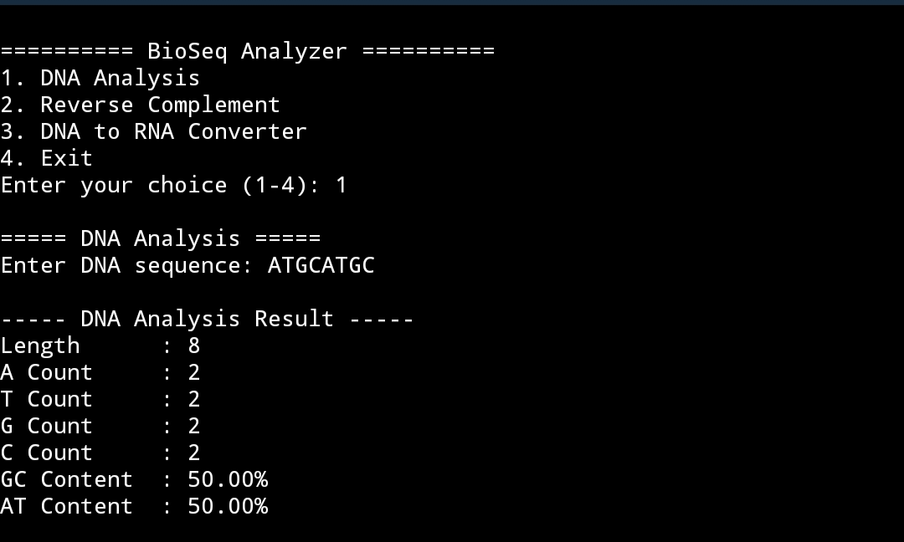
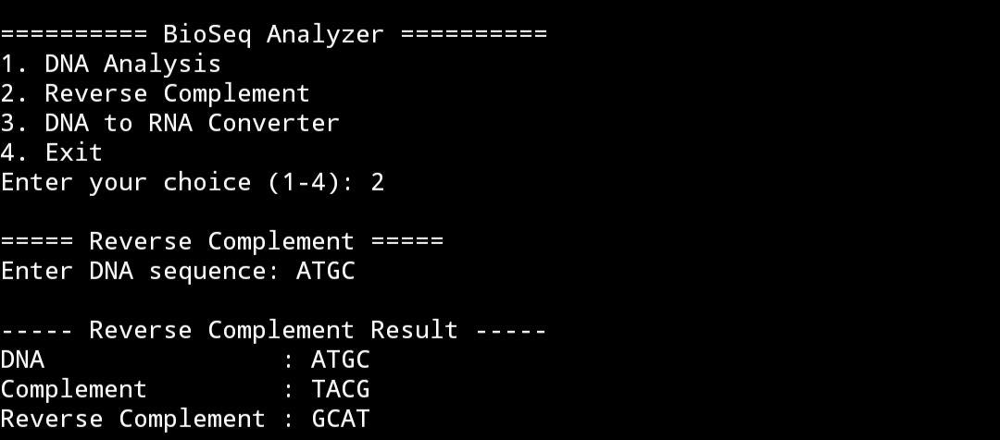
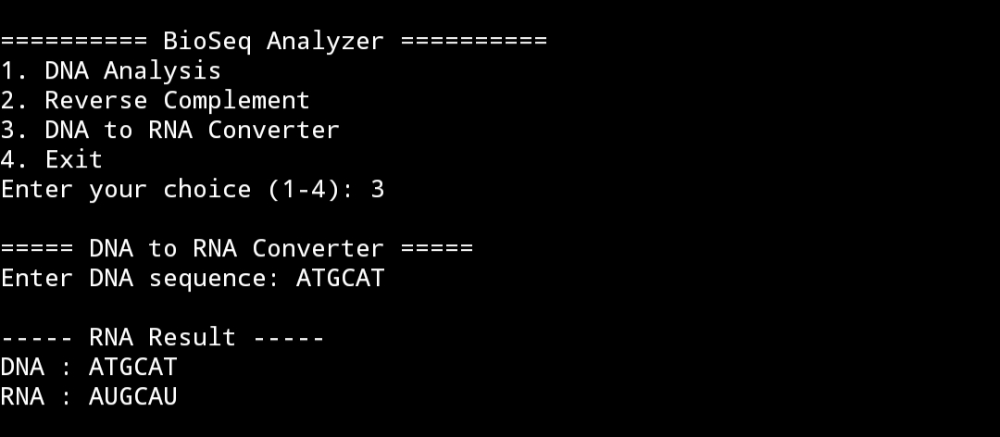
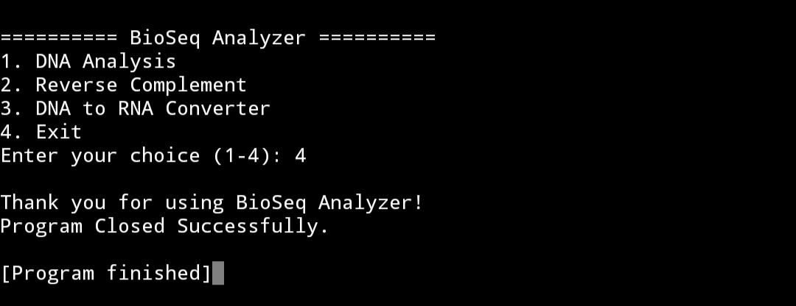

# BioSeq-Analyzer
Python-based bioinformatics tool for basic DNA sequence analysis

## Features

- DNA sequence validation
- DNA length calculation
- A, T, G, C nucleotide counting
- GC and AT content calculation
- Complement sequence
- Reverse complement
- DNA to RNA conversion
- Menu-based interface

## Technologies Used

- Python
- Bioinformatics
- String Processing

## How to Run

Run the program using Python:

python bioseq_analyzer.py

Then enter a DNA sequence containing A, T, G and C.

## Results

The project successfully performs:

- DNA sequence analysis
- Reverse complement generation
- DNA to RNA conversion
- Program exit through menu

## Output Screenshots

Four output screenshots are included in this repository to demonstrate the working of the program.

## Author

Priyanshi Patel

## Project Purpose

This project was developed to practice Python programming and basic bioinformatics concepts through DNA sequence analysis.

### 1. DNA Analysis

### 2. Reverse Complement

### 3. DNA to RNA Conversion

### 4. Exit

